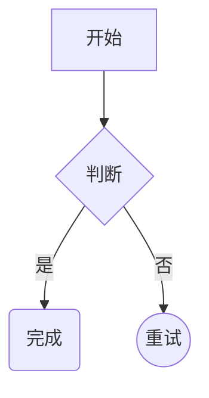
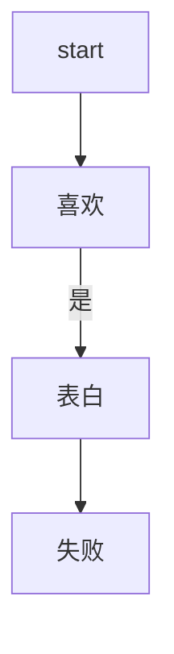
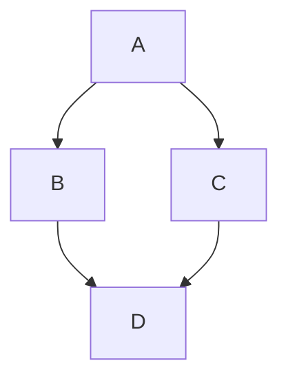
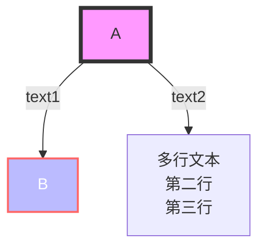

# 深度学习术语

MSE 均方误差 ：差值平方，对异常值敏感；处处可导。[[深度学习#^6191ff]]

MAE 平均绝对值误差：差值做绝对值，有鲁棒性；x=0出不可导。


# 计算机知识

网址名字

通讯接口


# 操作

# gemini看不到照片

**解决方案**：关闭canve

## obsidian怎么把图片导入

## markdown语言方块

==hhhhh==

==注意事项==

## 1.做高亮
==方法==：前后加等号

## 2.代码框

**做法**：前后加反引号```
```

`print("hello")`

```
注释框哈哈哈哈哈

```


```python
def sayhi():
     print("hello")
```


	
	缩进4个空格和1个tab会更美观哦！
	


事例展示：
### 代码示例

行内代码
Python 中可以使用 `range(10)` 函数。

多行代码块
```python
import requests

def get_data(url):
    response = requests.get(url)
    return response.json()
```

不同语言的代码
```html
<!DOCTYPE html>
<html>
  <body>
    <h1>标题</h1>
  </body>
</html>
```

```bash
npm install package-name
```


```
主要是这样的
	你懂吧
		麻烦懂一下

```


# Mermaid

### graph节点形状设计
[方形]
(圆角)
{菱形}
((圆形))









### flowchart强大功能




### 注意事项
```注释用%%
```

1. & & 来注释

2. 流程图可能的朝向有：

- TB - 从上到下
- TD - 自上而下/同自上而下
- BT - 从下往上
- RL - 从右到左
- LR - 从左到右

3. flowchart中节点类型
	{里面菱形}
	(圆角)
	([体育场])
	[(圆柱形)]
	((圆形))
	{{六边形}}
	[\平行四边形\]
	(((双圆))) 


# 其他术语

UX improvement 即用户使用体验。user experience.

API Application Programming Interface - *“控制按钮”**或**“工具箱”**。

SDK（Software Development Kit） 中文全称为 **软件开发工具包**

# 英语单词

backbone   n.脊柱，脊椎骨

Greece  n.希腊

geek  n.极客


# 待办清单

- [ ] 验证dinov2的train.py脚本
- [x] 学习mermaid语法
- [ ] 学习采集DWM数据


# 疑难问题解决


本文档旨在解答关于深度学习模型结构（Backbone/Head）、双 ViT 架构（教师-学生模式）、EMA 更新机制以及优化器与调度器的核心概念。

## 1. 深度学习模型通用架构图解 (Backbone & Head)

几乎所有现代深度学习模型（特别是视觉模型）都可以拆解为以下几个部分。为了让你加深理解，我们将其类比为“处理流水线”。

### 核心组件

- **Input (输入)**: 图像、文本等原始数据。
    
- **Backbone (骨干网络)**:
    
    - **作用**: 负责“看懂”图片，提取特征。它不关心具体任务（分类还是检测），只负责把图片变成计算机能理解的特征向量。
        
    - **例子**: ResNet, VGG, ViT (Vision Transformer)。
        
- **Neck (颈部 - 可选)**:
    
    - **作用**: 对特征进行再加工或融合（比如把不同尺度的特征拼在一起）。
        
    - **例子**: FPN (Feature Pyramid Network)。
        
- **Head (头部)**:
    
    - **作用**: 负责具体任务。利用 Backbone 提取的特征来输出结果。
        
    - **例子**: 全连接层 (分类任务), 边界框回归器 (检测任务)。
        

### 架构示意图 (Mermaid)

```
graph LR
    A[输入图片 Input] --> B[<b>Backbone 骨干网络</b><br/>(ResNet/ViT)]
    B -- 提取特征 --> C[Neck 颈部 (可选)<br/>(FPN)]
    C -- 融合特征 --> D[<b>Head 头部</b><br/>(具体任务)]
    
    subgraph "Head 的不同类型"
    D -.-> E[分类 Head<br/>(输出类别概率)]
    D -.-> F[检测 Head<br/>(输出坐标框)]
    D -.-> G[分割 Head<br/>(输出像素掩码)]
    end
```

**直观理解**:

- **Backbone** 就像人的**眼睛和视觉皮层**，负责看到线条、颜色、形状，理解这是个什么东西。
    
- **Head** 就像人的**大脑决策区**。如果你要用来“分辨猫狗”，就装一个“分类 Head”；如果你要用来“画出物体轮廓”，就装一个“分割 Head”。
    

## 2. 双 ViT 架构与教师-学生 (Teacher-Student) 模式

### Q: 双 ViT 架构都是教师-学生架构吗？

**A: 不一定，但你提到的带有 EMA 的通常是指“自监督学习”中的教师-学生架构（如 DINO, MoCo v3）。**

- **情形 A：纯粹的双分支结构 (Dual-Branch)**
    
    - 有些论文叫 "Dual ViT" 是指用两条路径分别处理不同大小的 Patch（比如一条路看细节，一条路看全局），最后融合。这种**不是**教师-学生架构。
        
- **情形 B：教师-学生架构 (Teacher-Student) —— 你最可能遇到的情况**
    
    - 在**自监督学习 (Self-Supervised Learning)** 或 **知识蒸馏 (Knowledge Distillation)** 中，会使用两个结构相同（或相似）的 ViT，一个叫 Student，一个叫 Teacher。
        

### 教师-学生架构详细分析 (以 DINO 为例)

这是一个**“自己教自己”**的过程。

```
graph TD
    Img[输入图片] --> View1[视图 1 (裁剪/增强)]
    Img --> View2[视图 2 (裁剪/增强)]
    
    View1 --> Student[<b>学生模型 Student</b><br/>(需要梯度更新)]
    View2 --> Teacher[<b>老师模型 Teacher</b><br/>(不进行梯度更新<br/>EMA 更新)]
    
    Student -- 输出预测 --> PredS
    Teacher -- 输出目标 --> PredT
    
    PredS -- "学生要去拟合老师的输出" --> Loss(计算损失 Loss)
    Loss -- "反向传播更新" --> Student
    Student -. "EMA (平滑移动平均)" .-> Teacher
```

- **逻辑**:
    
    1. 把一张图做两种不同的变形（View 1 和 View 2）。
        
    2. Student 看 View 1，Teacher 看 View 2。
        
    3. **目标**: 我们强迫 Student 产生的特征，尽可能接近 Teacher 产生的特征。
        
    4. **关键点**: Teacher 比 Student 更“稳重”，Student 负责拼命学习 Teacher 的输出来优化自己。
        

## 3. 为什么要用 EMA 更新老师模型？EMA 是什么？

### Q: 为什么要用 EMA？都是这样的吗？

**A: 在自监督学习（如 DINO, BYOL, MoCo）中，通常都必须用 EMA。**

如果不使用 EMA，直接让 Teacher = Student，或者 Teacher 固定不变，模型很容易**“崩塌” (Collapse)**。

- **模型崩塌**: 模型发现这太难了，干脆所有图片都输出同一个全 0 向量，这样 Loss 瞬间变为 0。
    
- **EMA 的作用**: EMA 让 Teacher 变成 Student 的**“历史平均版本”**。Teacher 变化很慢、很稳定，Student 变化快。Student 追逐一个稳定且不断变好的目标（Teacher），训练才能收敛。
    

### EMA (Exponential Moving Average) 是什么？

EMA 叫**指数移动平均**。它是一种更新参数的数学公式。

假设：

- $\theta_s$ 是学生模型的参数（当前这一轮刚更新完的）。
    
- $\theta_t$ 是老师模型的参数。
    
- $\alpha$ 是动量系数（Momentum），通常很大，比如 0.999。
    

更新公式:

$$ \theta_t = \alpha \cdot \theta_t + (1 - \alpha) \cdot \theta_s $$

人话解释:

老师的新参数 = 99.9% 的老师旧参数 + 0.1% 的学生新参数。

这意味着老师模型**更新非常缓慢**，它不仅仅是当前的权重，而是**过去所有时刻学生权重的加权平均**。这使得 Teacher 模型产生的特征非常平滑、稳定，噪声少，非常适合指导 Student。

## 4. 调度器 (Scheduler) 和 优化器 (Optimizer)

这是训练任何深度学习模型（不只是 ViT）都**必须**有的两个组件。

### 形象类比：下山

想象你在山上（高 Loss），要走到山谷底（低 Loss）。

#### 1. 优化器 (Optimizer) —— 走路的方式

- **定义**: 决定如何根据计算出的梯度（方向）来更新模型参数的算法。
    
- **功能**: 它看着梯度的方向，决定往哪走，走多远。
    
- **常见类型**:
    
    - **SGD (随机梯度下降)**: 朴实无华，一步一步往下走。
        
    - **Adam / AdamW**: 比较聪明，如果某个方向坡度变化大，它会自适应调整步伐；如果有惯性，它会利用动量冲过小坑。**ViT 通常使用 AdamW。**
        

#### 2. 调度器 (Scheduler) —— 步伐的策略

- **定义**: 决定**学习率 (Learning Rate)** 随时间如何变化的策略。学习率就是“步长”。
    
- **功能**:
    
    - **刚开始 (Warmup)**: 步子小一点，先适应一下地形（防止模型一开始就跑飞）。
        
    - **中间**: 步子大一点，快速下山。
        
    - **最后 (Decay)**: 快到谷底了，步子要非常非常小，精细调整，防止一步跨过谷底又上山了。
        
- **常见类型**:
    
    - **Cosine Annealing (余弦退火)**: 学习率像余弦曲线一样平滑下降（ViT 常用）。
        
    - **StepLR**: 每隔几轮，学习率直接减半。
        

### 总结关系

1. **Loss Function**: 告诉你现在在多高的山上。
    
2. **Optimizer**: 负责迈腿走路（更新权重）。
    
3. **Scheduler**: 拿着大喇叭喊口令，告诉 Optimizer “这一轮步子迈大点” 或 “这一轮步子迈小点”。
    

```
graph TD
    Data[数据] --> Model[模型]
    Model --> Loss[计算 Loss]
    Loss -- 梯度 Gradient --> Optimizer[<b>优化器</b><br/>(SGD/AdamW)]
    Scheduler[<b>调度器</b><br/>(Cosine/Step)] -- 调整学习率 lr --> Optimizer
    Optimizer -- 更新权重 Weight --> Model
```


# 深度学习基础概念指南：Backbone、架构与预训练

欢迎入门深度学习！这些术语是这个领域的基石，理解它们对于阅读论文和使用代码非常有帮助。

## 1. 架构 (Architecture) vs. 模型 (Model)

这两个词经常被混用，但在严格定义上，它们有明显的区别。我们可以用**“盖房子”**来打比方：

### **架构 (Architecture) = 设计图纸**

- **定义**：架构是指神经网络的**结构设计**。它规定了网络有多少层、每层是什么类型（卷积层、全连接层等）、层与层之间怎么连接。
    
- **特点**：它是一段代码或数学逻辑，还没有“经验”或“记忆”。
    
- **例子**：`ResNet-50`、`Transformer`、`YOLOv5`。当你下载这些代码时，你得到的是架构。
    

### **模型 (Model) = 装修好的实体房子**

- **定义**：模型是**架构 + 参数 (权重 Weights)**。
    
- **特点**：当架构经过数据训练后，它的内部参数（数以亿计的数字）被调整好了，能够处理具体任务。这时候它就是一个“模型”。
    
- **例子**：
    
    - “我正在设计一个新的**架构**。”（指设计网络结构）
        
    - “请把训练好的**模型**发给我。”（指结构 + 训练好的权重文件，通常是 `.pth` 或 `.h5` 格式）
        

> **总结**：架构是骨架，模型是骨架加上了肉（参数）。

## 2. Backbone (骨干网络) 是什么？

在深度学习（特别是计算机视觉）中，一个完整的模型通常由几个部分组成。**Backbone** 是其中最核心的部分。

### **形象理解：人的身体**

想象一个专门负责**“看图识物”**的人：

- **眼睛和视神经 (Backbone)**：负责接收图像，提取线条、颜色、形状、纹理等信息，并传给大脑。
    
- **大脑判断区 (Head)**：接收视神经传来的信息，做出判断——“这是一只猫”。
    

### **技术定义**

- **Backbone (骨干网络)**：模型中负责**特征提取**的部分。它通常是一个经典的、成熟的架构（如 `ResNet`、`VGG`、`MobileNet`）。它的作用是把输入的原始图片（一堆像素点）变成计算机能理解的**特征图 (Feature Map)**。
    
- **Head (头)**：接在 Backbone 后面，利用提取到的特征来完成具体任务（比如分类、检测物体位置）。
    

架构公式：

$$\text{完整模型} = \text{Backbone (特征提取)} + \text{Head (具体任务)}$$

> **为什么叫 Backbone？** 因为它支撑起了整个网络，就像脊柱支撑身体一样。你可以在同一个 Backbone 后面接不同的 Head 来做不同的事（比如接一个 Head 做分类，或者接另一个 Head 做人脸识别）。

## 3. 预训练 (Pre-training) 是如何实现优化的？

你问到“预训练到底是怎么实现模型的优化的”，其实这涉及到模型**初始化**的问题。

### **直观比喻：大学教育 vs. 职业培训**

- **从零训练 (Training from Scratch)**：
    
    - 这就好比找一个刚出生的婴儿，直接教他做“修飞机”的工作。你得先教他认字、学物理、学拿扳手，最后才学修飞机。
        
    - **效率**：极低，需要巨量的数据和时间。
        
    - **对应**：模型参数随机初始化（乱猜），从头开始学提取特征。
        
- **预训练 (Pre-training) + 微调 (Fine-tuning)**：
    
    - 这就好比找一个**大学毕业生**来修飞机。他已经读过书（在海量通用数据上学过），认识世界，有基础逻辑。你只需要教他修飞机的具体步骤（微调）即可。
        
    - **效率**：极高，只需要少量数据就能训练得很好。
        
    - **对应**：模型参数已经在一个超大数据集（如 ImageNet，包含1000类物体）上训练过了。
        

### **技术原理：优化视角的解释**

在数学上，训练模型就是在一个巨大的、坑坑洼洼的山脉中寻找**最低点**（损失函数最小点）。

1. **随机初始化 (没有预训练)**：
    
    - 把你通过直升机随机扔到山脉的某个位置。你可能落在半山腰，离最低点十万八千里。你得走很久，而且很容易掉进错误的坑里（局部最优）。
        
2. **预训练 (Pre-training)**：
    
    - 预训练相当于通过在通用数据上的学习，已经把你送到了**离最低点非常近的山谷入口**。
        
    - **优化优势**：
        
        - **起点更好**：你的参数不再是随机的噪声，而是已经具备了检测边缘、纹理等通用能力。
            
        - **收敛更快**：因为离终点近，你只需要走几步（微调）就能到达目的地。
            
        - **泛化更强**：预训练模型“见多识广”，不容易钻牛角尖（过拟合）。
            

### **总结表格**

|                        |              |                             |
| ---------------------- | ------------ | --------------------------- |
| **概念**                 | **解释**       | **举例**                      |
| **架构 (Architecture)**  | 代码写的网络结构设计   | ResNet-50 的代码               |
| **模型 (Model)**         | 架构 + 训练好的参数  | `resnet50.pth` 文件           |
| **Backbone**           | 负责提取特征的基础网络  | 用 ResNet-50 去掉最后一层，用来提取图片特征 |
| **预训练 (Pre-training)** | 先学通用知识，赢在起跑线 | 先在 ImageNet 上训练，再拿来做猫狗分类    |


# Ubuntu和Linux的关系理解：

## 核心关系
**Ubuntu是基于Linux内核的操作系统**，是Linux的一个具体发行版本。

## 详细解释

### 1. **Linux内核**
- **Linux本身**指的是由Linus Torvalds创建的操作系统**内核**
- 内核是操作系统的核心，负责管理硬件、内存、进程等基础功能
- 单独的内核无法直接使用，需要配合其他软件

### 2. **Linux发行版**
- **Ubuntu**是由Canonical公司（最初由南非企业家Mark Shuttleworth创立）开发的**Linux发行版**
- 发行版 = Linux内核 + GNU工具 + 软件包管理器 + 桌面环境 + 应用软件
- 其他知名发行版：Debian（Ubuntu的父系统）、Fedora、CentOS、Arch Linux等

### 3. **Ubuntu的特点**
- 基于Debian，但更注重易用性和用户体验
- 定期发布版本（每6个月一个常规版，每2年一个LTS长期支持版）
- 预装了常用软件和友好的图形界面
- 拥有庞大的社区支持和丰富的软件仓库

## 类比理解
- **Linux内核** ≈ 汽车发动机
- **Ubuntu** ≈ 一辆完整的丰田汽车（包含发动机、车身、内饰等）
- 其他发行版 ≈ 其他品牌的汽车

## Ubuntu的优势
1. **用户友好**：对新手友好，安装配置简单
2. **软件丰富**：拥有庞大的软件仓库（apt）
3. **社区活跃**：文档齐全，问题容易找到解决方案
4. **硬件兼容性好**：支持大多数主流硬件
5. **免费开源**：完全免费使用和修改

简单说：**Linux是核心引擎，Ubuntu是搭载这个引擎的完整汽车，并且是最受欢迎的车型之一。**