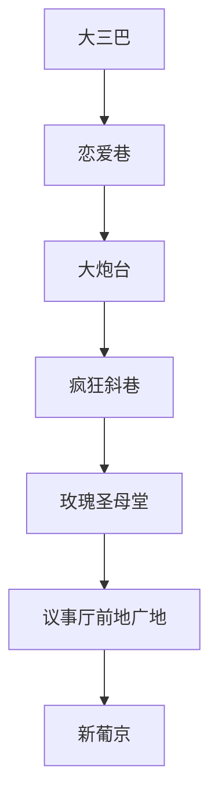
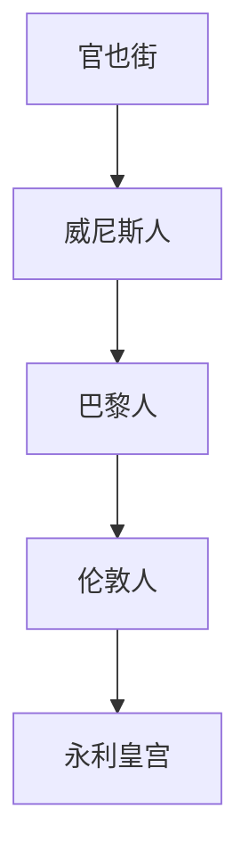

# 时间安排

6: 25集合

8:30 准备离开

# 路线安排

反

正

![400][d3770ed476125769733a2ca07ec046bc.jpg]

![[37051cda7bfe0b41e1fbc0e7c0fe0999.jpg]]

# 通勤路线

## 拱北口岸-->新葡京
发财车

## 新葡京-->大三巴
步行

## 大三巴-->官也街
公交车

## 永利皇宫-->拱北口岸
发财车

# 待定路程

新豪影汇

# 注意事项

1. 充电宝充满电

2. 要带港澳通行证

3. 带矿泉水！！！！干粮！！！！

4. 换澳币 

5. 发财车需要排队，留意形式

6. 坐公交，澳门通（）

7. 报警999

