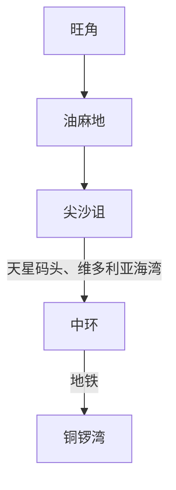
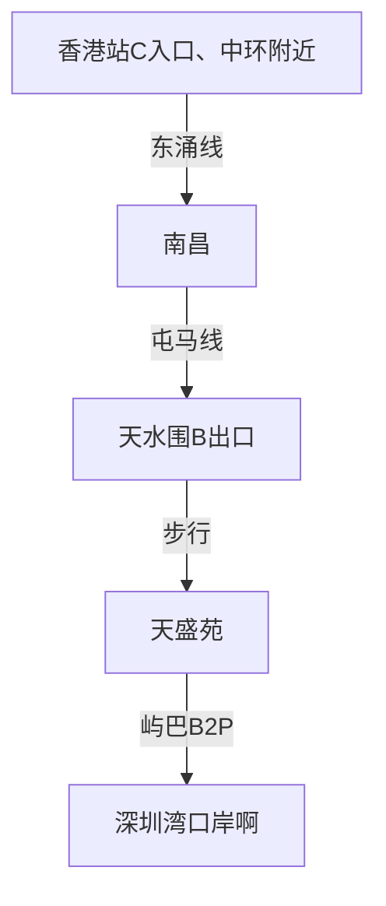

# 路线选择

### 关键时间节点：
6:30出发
21点从中环准备回程
### 去程
选择坐B3X坐到屯门，然后到屯门地铁站购买一日卡。

**注意**：删去了一些热门景点，坚尼地城和铜锣湾，商业化严重或者比较一般。如果时间富足可以考虑逛逛。

### 回程

用时1小时44分钟、9点出发。    B3X

# 通勤
### 通勤选择
1. **地铁（港铁）**
    - **覆盖全港主要区域**，快捷准点，支持八达通/支付宝/微信扫码进站。
    - **推荐线路**：荃湾线（旺角、尖沙咀、中环）、港岛线（铜锣湾、上环）、东铁线（连接新界与市区）。
    - **贴士**：避开早晚高峰（8:00-9:30, 17:30-19:00）更舒适。

	- **市区线路（如荃湾线、港岛线、观塘线等）**  
		  - 短途（1-3站）：约 **4-8元**  
		  - 中途（如旺角→铜锣湾）：约 **7-12元**  
		  - 长途（如东涌→中环）：约 **15-25元**  
		- **机场快线**（特殊线路，较贵）  
	- **香港站→机场站**：单程 **115元**（八达通约 **110元**）  
	- **优惠**：  
		  - 八达通享有小幅折扣（约5-10%）。  
		  - **地铁特惠站**（部分车站外设感应器，拍卡后在该站入闸可省2-3元）。

2. **巴士（双层巴士/小巴）**
    
    - **双层巴士**：线路覆盖广，适合游览（如城巴、九巴）。
        
    - **绿色专线小巴**：固定路线，班次密，可到地铁未覆盖的区域。5-12元。
        
    - **红色小巴**：无固定路线，需现金付费，不建议新手首选。8-20元。
    ==注意==：
    - **市区线路**：短途 **5-8元**，长途（如过海隧道巴士） **10-20元**。  
	- **新界线路**：如往返沙田/屯门等，约 **8-15元**。  
	- **机场巴士**（如A21）：市区→机场约 **33-40元**。

2. **天星小轮**
    
    - **线路**：往返尖沙咀-中环7号/湾仔8号。
        
    - **特色**：百年历史，票价低廉（约3-5港币），欣赏维港景色的绝佳方式。
        
3. **叮叮车（香港电车）**
    
    - **范围**：仅限香港岛北部（坚尼地城至筲箕湾）。
        
    - **体验**：复古双层电车，票价3港币，适合慢节奏游览港岛街景。

### 重要节点

#### 深圳湾口岸-->旺角
乘坐 前往“旺角”或“太子”的直达巴士票（例如“环岛中港通”“永东巴士”）
**时间**：约50-70分钟（含过关时间）。**费用**：约50-80港币。

#### 中环-->深圳湾口岸
==注意==：一定一定要在8、9点左右出发，留足时间否则过不了关，重点看回程部分

#### 中途
选择暴走或者地铁。景点离得近。

# 景点选择

- **旺角**：霓虹灯街头，活力满满。
- **维多利亚港夜景**：世界三大夜景之一，晚上8点有“幻彩咏香江”灯光秀，超级浪漫震撼。
- **尖沙咀星光大道**：海滨长廊，看维港对岸景色，有明星手印和李小龙雕像，夜景绝美。
- **海港城**：尖沙租和天星小轮交界。
-  **天星小轮+香港摩天轮** ：经典维港体验。
- **兰桂坊/中环街头**：壁画、老建筑、夜生活。  半山扶梯，重庆森林取景地。
- **铜锣湾**

# 购物推荐
香港购物优势主要是品牌齐全、经常打折、有些东西比深圳便宜或正品保障更好。重点推荐：

- **护肤品/化妆品**（最值得买！）：
    - 日韩欧品牌（SK-II、CPB、La Mer、YSL、Dior等）在Sasa、卓悦、Colourmix、龙城大药房经常打折，比内地专柜便宜20-40%。
    - 药妆（Eve Lom卸妆膏、城野医生毛孔系列、澳洲Lucas木瓜膏(很润，干起皮)等）。
- **药品/保健品**：
    - 万宁、屈臣氏买：日本眼药水（FX、Rohto）、撒隆巴斯贴、缓冲阿司匹林、虎标止痛膏、港版感冒药（潘adol、保怡灵）。
    - 有些药内地买不到或贵很多。
- **零食手信**：
    - 老婆饼（挂绿、莲香楼）、凤凰卷、鸡蛋仔（利强记）、曲奇（珍妮聪明小熊、奇华）。
    - 茶叶（福茗堂、英记茶庄的普洱、铁观音）。
- **其他热门**：
    - 婴儿奶粉/用品（如果有需要，香港版本口碑好）。
    - 苹果产品（官方Apple Store有时促销，比内地稍便宜）。
    - 金饰（周大福、六福，工费比内地低）。
    - 迪士尼/海洋公园周边（如果去玩的话超可爱）。

购物区推荐：尖沙咀（海港城、K11）、铜锣湾（SOGO、时代广场）、旺角（女人街、朗豪坊）。很多店支持支付宝/微信退税更方便。

# 注意事项：

- 通关：需**有效港澳通行证+香港签注+ 身份证**。

- 交通：711买**八达通卡**，选择一日卡 。==注意==：一日卡只包含公交，电车，电轨。

- 支付：香港用港币/八达通/支付宝/微信、换港币。

- 天气：香港湿热，带薄外套、室内空调冷、

- 装备：舒适鞋、充电宝。

- **深圳湾口岸的开放时间**：06:30 - 24:00

- **叮咚车**只有在香港岛北部沿海路线有。

-  **核心区域**：
    - **毕打街（Pedder Street）站**：位于中环核心商业区，靠近置地广场，是东西线路的重要交汇点。
    - **银行街（Bank Street）站**：靠近汇丰总行大厦和立法会大楼。
	- **砵典乍街（Pottinger Street）站**：靠近中环至半山自动扶梯和兰桂坊。
- 找到天星小轮：**尖沙咀天星码头**（就在钟楼旁边，海港城出来走几分钟就到）。码头内部有不同闸口。**去中环**：通常7号码头

- 千万不要坐到**机场的地铁线**。

- 买流量卡、开数据漫游

- 带纸巾、塑料袋。

- **地铁禁忌**：禁止在地铁上手机声音外放… 🚫禁止饮食！喝口水都可能被罚！ 🚫禁止蹲下/踩座椅！哪怕腿酸也不行！ 🚫禁止按紧急钮！除非真紧急情况！ 🚫禁止误坐头等舱，上错车的可以在连接处回到普通车厢！ 🚫禁止地铁逗留超150分钟！ 🚫禁止元朗轻铁直接坐回头，想要坐回头，要重新拍卡乘坐！

- 带伞

- 乱丢垃圾

- 学生证

- 准备食物

- 换港币

# 网上建议：

**tip1**：
如果想吃环境好一点的去尖沙咀那边，如果想地道一点接地气一点旺角那也不错。一般来香港不都想看看维港吗，住尖沙咀可能会方便点，而且油尖旺挨的也很近，看预算吧

# 地图概况

### **一、香港18区方位分布**

#### **1. 香港岛（4区）**

- **中西区**：港岛西北部，包括中环、上环、西环、山顶等。
- **湾仔区**：港岛北部，包括湾仔、铜锣湾东部、跑马地等。
- **东区**：港岛东北部，包括北角、筲箕湾、太古、柴湾等。
- **南区**：港岛南部，包括香港仔、浅水湾、赤柱、海洋公园等。
#### **2. 九龙（5区）**

- **油尖旺区**：九龙西南部，包括油麻地、尖沙咀、旺角（您目的地之一）。
- **深水埗区**：九龙西北部，包括深水埗、长沙湾、石硖尾等。
- **九龙城区**：九龙中部，包括九龙城、何文田、红磡等。
- **黄大仙区**：九龙东北部，包括黄大仙、钻石山、新蒲岗等。
- **观塘区**：九龙东部，包括观塘、牛头角、蓝田等。
#### **3. 新界（9区）**
- **北区**：新界最北，连接深圳（罗湖、粉岭、上水等）
- **大埔区**：新界东北部，包括大埔、科学园等。
- **沙田区**：新界中部，包括沙田新城、马鞍山等。
- **西贡区**：新界东南部，包括西贡郊野、将军澳新市镇。
- **荃湾区**：新界西南部，包括荃湾、葵涌等。
- **屯门区**：新界西北部，包括屯门新市镇。
- **元朗区**：新界西北平原，包括元朗、天水围等。
- **葵青区**：新界西南，包括葵涌、青衣岛。
- **离岛区**：涵盖香港所有离岛（如大屿山、南丫岛、长洲等）。

==注意==：我们主要涉及到**油尖旺区**，**中西区**，**湾仔区**。

![[Pasted image 20260130162018.png]]

![[Pasted image 20260130161844.png]]
![[Pasted image 20260130161946.png]]
![[Pasted image 20260129121204.png]]
![[Pasted image 20260130163659.png]]
![[Pasted image 20260130155413.png]]

![400][d9b883192ee6f386157a2f1ccc1567e6.jpg]

![[Pasted image 20260130155959.png]]

